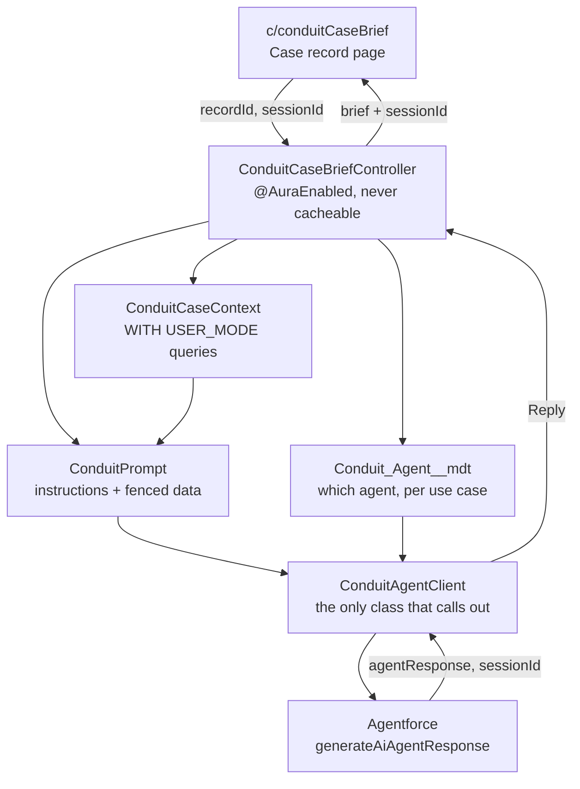

# Conduit

Call an Agentforce agent from Apex, and put the answer somewhere a user can act on it.

Agentforce ships an excellent conversational surface. What it does not give you is a clean
way to say "take this record, assemble the context that matters, ask the agent, and render
the result on the page." Conduit is that layer: a small, tested set of Apex classes for
invoking an agent, a reference Lightning Web Component built on top of them, and the
Agentforce agent they call.

Most examples of this stop at the invocation and leave you to supply the agent. Conduit
ships both halves, so `sf project deploy start` gives you something that actually runs.

The package is deliberately thin. It is roughly 600 lines of Apex, and most of that is the
parts people get wrong the first time, field-level security on the context queries, session
handling for follow-up questions, and error messages that name the thing to go and fix.

## What it gives you

**`ConduitAgentClient`** wraps the `generateAiAgentResponse` invocable action and is the
only class that touches the agent. It validates inputs before spending a call, turns
platform failures into readable messages, and returns both the reply and the session id.

**`ConduitContext`** accumulates record data into an agent-ready payload. It truncates long
text so one runaway email body cannot crowd out the rest of the case, and drops empty values
so the agent is not handed a wall of nulls.

**`ConduitPrompt`** assembles the message. Instructions first, record data last and fenced,
because record data is attacker-influenced and should never be read as instruction.

**`ConduitCaseContext`** is the worked example: a Case with its account, contact, recent
comments, email and open tasks, every query running `WITH USER_MODE`.

**`c/conduitCaseBrief`** is the component. It writes a handover brief for whoever picks the
case up next, then lets the user keep asking questions against the same agent session.

## How it fits together



The session id is the part worth understanding. Agentforce has no memory between calls
unless you hand it back the id from the previous one. It travels agent to client to
controller to component and back again, which is why the component holds it in state rather
than the Apex holding it in a static.

## The agent

**`Conduit_Case_Agent`** is an Agentforce **employee agent** for support engineers working a
case. It is a hub-and-spoke machine: `case_router` loads a case, and nothing else runs until
it has. Four spokes:

| Subagent        | Writes? | What it does                                                                          |
| --------------- | ------- | ------------------------------------------------------------------------------------- |
| `case_summary`  | no      | Handover brief built from the case and a merged feed of its comments, email and tasks |
| `similar_cases` | no      | Previously closed cases with similar subjects, and how each was resolved              |
| `case_updates`  | **yes** | Status and priority changes, and internal notes                                       |
| `reply_draft`   | **yes** | Drafts a customer reply onto the case. It cannot send one                             |

Plus the standard `off_topic` and `ambiguous_question` guardrails.

Three design rules are worth knowing before you extend it:

**Writes propose before they apply.** `ConduitCaseStatusUpdate` and `ConduitEmailDraft` take
an `apply` flag: false computes and returns what would happen, true commits. The agent shows
the engineer the preview, and the platform's own `require_user_confirmation` gate stops the
write until they agree.

**Claims are bound to action output.** The agent cannot say a note or draft was saved unless
the tool returned. `note_result` and `draft_result` are set from action outputs and checked
at the top of each subagent's instructions. This is not a stylistic choice: without it the
agent will state that a draft was saved when no record exists. See the Deltas section of
[the agent spec](specs/Conduit_Case_Agent-AgentSpec.md).

**Drafts are never sent.** `ConduitEmailDraft` writes `EmailMessage` with `Status = '5'` and
resolves the recipient in Apex from the case contact. The agent supplies subject and body
only, and never chooses who receives mail.

The full design, including the subagent map and every action contract, is in
[`specs/Conduit_Case_Agent-AgentSpec.md`](specs/Conduit_Case_Agent-AgentSpec.md).

## Requirements

- An org with Agentforce enabled and at least one **active** agent
- **API version 64.0 or later** on the calling Apex class. This is the one that bites: the
  floor is per class, not per org, and below it the action cannot be resolved. The error
  does not mention API versions.
- Salesforce CLI, for deployment
- Node.js, only if you want to run the Jest tests

## Install

```bash
git clone https://github.com/VurtuoLabs/conduit.git
cd conduit
sf project deploy start --source-dir force-app --target-org <your-org-alias>
```

This deploys both halves: the invocation layer, and **Conduit Case Agent**, the Agentforce
employee agent it calls. Publish and activate the agent:

```bash
sf agent publish authoring-bundle --api-name Conduit_Case_Agent --target-org <your-org-alias>
sf agent activate --api-name Conduit_Case_Agent --target-org <your-org-alias>
```

`Conduit_Agent__mdt.Case_Brief` already points at `Conduit_Case_Agent`, so there is nothing
to configure unless you want to point it at a different agent. To do that, open **Custom
Metadata Types**, then **Conduit Agent**, then **Manage Records**, and edit the **Case
Brief** record.

If you do point it elsewhere, copy the value from Agent Builder rather than typing it. It is
usually not the display label and often carries a numeric suffix, and a mismatch here is the
most common reason an agent is reported as not found.

Assign the **Conduit User** permission set to anyone who needs the component. It grants the
Apex entry points only. Agentforce access, record visibility and field visibility all
continue to come from the user's own profile and permission sets, which is the point.

Finally, add **Case Brief** to the Case record page in the Lightning App Builder, then save
**and activate**. A page saved but not activated is the usual reason a correctly deployed
component does not appear.

## Verify it works

Before wiring anything up, confirm the org can reach the agent at all. In anonymous Apex:

```apex
Invocable.Action action = Invocable.Action.createCustomAction(
    'generateAiAgentResponse',
    'YOUR_AGENT_API_NAME'
);
action.setInvocationParameter('userMessage', 'Say hello.');
List<Invocable.Action.Result> results = action.invoke();
System.debug(results[0].isSuccess());
System.debug(results[0].getErrors());
System.debug(results[0].getOutputParameters());
```

If that fails, the problem is org configuration and nothing in this package will fix it. If
it succeeds, anything still broken is in the context, the prompt or the component. The same
snippet is in [`scripts/apex/ping-agent.apex`](scripts/apex/ping-agent.apex).

## Using it for something other than cases

`ConduitCaseContext` is an example, not a framework requirement. To brief on a different
object, gather its data into a `ConduitContext` and describe the answer you want:

```apex
ConduitContext context = new ConduitContext();
context.put('name', opportunity.Name)
       .put('stage', opportunity.StageName)
       .put('amount', opportunity.Amount)
       .putDate('closesOn', opportunity.CloseDate);

String prompt = new ConduitPrompt()
    .instruct('You are briefing an account executive before a renewal call.')
    .section('Where the deal stands')
    .section('Risks')
    .section('What to raise on the call')
    .rule('Keep it under 150 words.')
    .withContext(context)
    .build();

ConduitAgentClient.Reply reply = ConduitAgentClient.send(
    ConduitAgentSettings.agentApiNameFor('Renewal_Brief'),
    prompt,
    null
);
```

Add a `Conduit_Agent__mdt` record named `Renewal_Brief` and it is wired up. The fencing and
the anti-injection rules come along automatically, because they live in `ConduitPrompt`
rather than in each caller.

## Security

Two separate mechanisms, and conflating them is how data leaks:

- `with sharing` on the class governs **which records** the running user can see.
- `WITH USER_MODE` on each query enforces **object and field-level security** for that query.

`with sharing` alone does not give you FLS. Without `WITH USER_MODE`, a user blocked from
reading `Case.Description` still receives it back, summarized, in the agent's answer. The
field is hidden in the UI and exposed through the AI. Every query in `ConduitCaseContext`
runs `WITH USER_MODE`, and `ConduitCaseContextTest` asserts it under a minimum-access user.

Treat any query added to a context class without `WITH USER_MODE` as a defect.

On prompt injection: anyone who can file a case can write instructions into its description.
`ConduitPrompt` puts real instructions ahead of the data, fences the data, and tells the
agent the fenced region is content rather than instruction. That lowers the odds. It does
not eliminate them, so nothing produced through this package should drive a write, an
approval, or an outbound message without a person in between.

## Cost and limits

Every generation is an agent call, so the component acts on click and never on page load.
Generating in `connectedCallback` would spend a call each time anyone opened any case,
including the ones nobody is working.

Agent invocation is synchronous and takes seconds. Never call it in a loop, and never inline
in a bulk trigger. For anything driven by data change rather than a click, use `Queueable`.

## Tests

```bash
sf apex run test --target-org <your-org-alias> --tests ConduitAgentClientTest \
  --tests ConduitPromptTest --tests ConduitCaseContextTest \
  --tests ConduitCaseBriefControllerTest --tests ConduitAgentSettingsTest \
  --result-format human --wait 10

npm install && npm test
```

The live call cannot be mocked, so `ConduitAgentClient.Client` exists as a seam and tests
inject a stub through `setClient`. The tests cover the parts that carry real risk: the
context queries, the assembled prompt, session handling and the error paths. None of them
assert on generated text, which is nondeterministic and would flake.

## Repository layout

```
conduit/
├── force-app/main/default/
│   ├── aiAuthoringBundles/Conduit_Case_Agent/   the agent, in Agent Script
│   ├── classes/            12 invocation + 6 agent action classes, all at API 64.0
│   ├── lwc/conduitCaseBrief/
│   ├── objects/Conduit_Agent__mdt/
│   ├── customMetadata/     Case_Brief, pointed at Conduit_Case_Agent
│   └── permissionsets/     Conduit User, including agentAccesses
├── specs/                  the agent spec, with build deltas and verification
├── scripts/apex/           ping-agent.apex
├── docs/TROUBLESHOOTING.md
├── config/                 scratch org definition
└── manifest/package.xml
```

## Troubleshooting

Agent errors are generic, so [`docs/TROUBLESHOOTING.md`](docs/TROUBLESHOOTING.md) maps what
you actually see to what is actually wrong. The three that account for most of it:

| Symptom                                        | Cause                              |
| ---------------------------------------------- | ---------------------------------- |
| `Invalid action type: generateAiAgentResponse` | Calling class is below API 64.0    |
| Success, but the answer is empty               | No agent topic covers the request  |
| Follow-up answers ignore the case              | The session id was not passed back |

## License

MIT. See [LICENSE](LICENSE).

Copyright (c) 2026 VurtuoLabs
