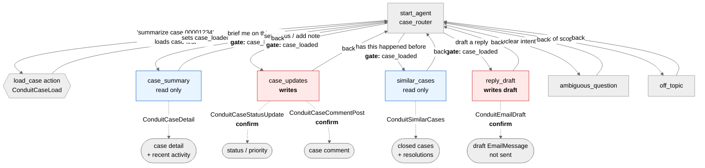

# Agent Spec: Conduit_Case_Agent

Status: **built, published and active** in `imperialealex@gmail.com` as version 1.
This document has been updated to match what was actually built. Where the design changed
during construction, the change and its reason are recorded in "Deltas from the original
design" at the end.

## Purpose & Scope

An internal agent for support engineers working a case. It loads a case, briefs the
engineer on it, finds precedent in previously closed cases, records changes on the record,
and drafts a customer reply for a human to review and send.

This is the agent Conduit was built to call. `Conduit_Agent__mdt.Case_Brief` previously held
the placeholder `REPLACE_WITH_YOUR_AGENT_API_NAME`, so the package invoked nothing. It now
holds `Conduit_Case_Agent`, verified by reading the record back out of the org, so the loop
is closed.

Scope is one case at a time. The agent does not browse queues, report across cases, or act
on any record other than the loaded case and its children.

## Behavioral Intent

**A case must be loaded before anything else happens.** Every domain subagent is gated on
`case_loaded == True`, enforced both by `available when` on the router's transitions and by a
`before_reasoning` guard inside each subagent. An agent that summarizes the wrong case, or
posts a comment to it, is worse than one that refuses.

**Reads are free; writes are confirmed.** The two subagents that modify Salesforce
(`case_updates`, `reply_draft`) set `require_user_confirmation: True` on every write action.
The engineer sees exactly what will change before it happens.

**The agent drafts customer email, it does not send it.** `ConduitEmailDraft` creates a draft
`EmailMessage` on the case. Sending stays a human action. An AI that can email customers
directly from a case is a different risk category than one that leaves a draft in the feed,
and nothing in this brief justifies the former.

**The LLM writes prose; Apex supplies facts.** Actions return structured record data. The
agent composes the brief from it. No action returns a pre-written summary, so there is no
second hidden model and every claim in the brief traces to a field the action returned.

**Record data is untrusted.** Case descriptions and inbound email are attacker-influenced.
The system block instructs the agent to treat retrieved record content as data to report on,
never as instructions to follow. This lowers the odds; it does not eliminate them, which is
the other reason writes are confirmation-gated.

**Security is the running user's.** Every query runs `WITH USER_MODE`. The agent cannot read
or write anything the engineer could not read or write directly.

## Subagent Map



All transitions are **handoffs** (`@utils.transition to`). There is no delegation: no
subagent needs to resume after another finishes, and delegation without an explicit return
transition silently drops the user into the router on their next utterance.

## Architecture Pattern

**Hub-and-spoke with a load gate.** `case_router` is the hub and the only place a case gets
loaded. Four domain spokes plus the two standard guardrails. Each spoke transitions back to
the hub rather than to a sibling, so there is exactly one path into each spoke and one gate
protecting it.

A separate `find_case` subagent was considered and rejected. Loading is a single action with
one input; giving it its own subagent adds a state to the machine without adding a decision.

## Variables

| Variable         | Type                      | Set by                       | Read by                     | Purpose                                                                     |
| ---------------- | ------------------------- | ---------------------------- | --------------------------- | --------------------------------------------------------------------------- |
| `case_reference` | `mutable string = ""`     | LLM slot-fill                | `load_case`                 | What the engineer typed: case number or record id                           |
| `case_id`        | `mutable string = ""`     | `load_case`                  | every action                | Resolved 18-char record id                                                  |
| `case_number`    | `mutable string = ""`     | `load_case`                  | instructions                | Display in prompts                                                          |
| `case_subject`   | `mutable string = ""`     | `load_case`                  | instructions                | Display and confirmation text                                               |
| `case_status`    | `mutable string = ""`     | `load_case`, `update_status` | instructions                | Current status, refreshed after a write                                     |
| `case_priority`  | `mutable string = ""`     | `load_case`, `update_status` | instructions                | Current priority                                                            |
| `case_loaded`    | `mutable boolean = False` | `load_case`                  | **all gates**               | The single gate every spoke depends on                                      |
| `last_change`    | `mutable string = ""`     | write actions                | `case_updates` instructions | What just changed, so the agent reports it rather than re-running the write |

No linked variables. Employee agents have no `MessagingSession`, and this agent takes its
case reference from the conversation rather than from record context.

## Actions & Backing Logic

**All six classes were written from scratch and are `IMPLEMENTED`.** The project had no
invocable Apex, no Flows and no Prompt Templates. Conduit's existing classes are
`@AuraEnabled`, which is not valid backing logic for an agent action, so none could be
reused. Every class is functional (real SOQL/DML under `WITH USER_MODE`), not a hardcoded
stub, because every action here is a data-access action.

> **Numeric outputs are returned as `string` throughout.** Bare `number` works in variable
> declarations but fails at publish in action I/O, and the `object` +
> `lightning__integerType` workaround adds ceremony for values the agent only ever prints.
> Counts and durations are formatted in Apex and returned as text.

### load_case (case_router)

- **Target:** `apex://ConduitCaseLoad`
- **Backing Status:** IMPLEMENTED
- **Confirmation:** not required (read only)

| Input     | Type   | Required | Source                                    |
| --------- | ------ | -------- | ----------------------------------------- |
| `caseRef` | string | Yes      | LLM slot-fill from the engineer's message |

| Output        | Type    | Visible? | Notes                                        |
| ------------- | ------- | -------- | -------------------------------------------- |
| `caseId`      | string  | No       | Internal, consumed by every other action     |
| `caseNumber`  | string  | Yes      | Confirms which case was loaded               |
| `subject`     | string  | Yes      |                                              |
| `status`      | string  | Yes      |                                              |
| `priority`    | string  | Yes      |                                              |
| `ownerName`   | string  | Yes      |                                              |
| `accountName` | string  | Yes      |                                              |
| `contactName` | string  | Yes      |                                              |
| `isEscalated` | boolean | Yes      |                                              |
| `found`       | boolean | No       | Internal flag driving the `case_loaded` gate |

Resolves either an 18/15-char Case id or a CaseNumber. Returns `found = False` rather than
throwing when nothing matches, so the router can ask again instead of erroring out.

### get_case_detail (case_summary)

- **Target:** `apex://ConduitCaseDetail`
- **Backing Status:** IMPLEMENTED
- **Confirmation:** not required (read only)

| Input    | Type   | Required | Source               |
| -------- | ------ | -------- | -------------------- |
| `caseId` | string | Yes      | `@variables.case_id` |

| Output           | Type         | Visible? | Notes                                              |
| ---------------- | ------------ | -------- | -------------------------------------------------- |
| `description`    | string       | Yes      | Truncated in Apex                                  |
| `daysOpen`       | string       | Yes      | Formatted in Apex, see numeric note                |
| `commentCount`   | string       | Yes      |                                                    |
| `emailCount`     | string       | Yes      |                                                    |
| `openTaskCount`  | string       | Yes      |                                                    |
| `lastActivity`   | string       | Yes      | Human-readable timestamp                           |
| `recentActivity` | list[object] | Yes      | `@apexClassType/c__ConduitCaseDetail$ActivityItem` |

`ActivityItem`: `source` (comment / email in / email out / task), `actor`, `occurredAt`,
`excerpt`. One merged, time-ordered feed is easier for the LLM to narrate than three parallel
lists, and it is what a handover brief actually needs.

> The two skill references disagree on `complex_data_type_name` for `list[object]` on an
> `apex://` target: the design reference specifies `@apexClassType/c__Class$InnerClass`, the
> type table says `lightning__textType`. Going with the design reference, which carries
> explicit apex:// examples. If publish rejects it, the fallback is flattening
> `recentActivity` to a preformatted string.

### update_status (case_updates)

- **Target:** `apex://ConduitCaseStatusUpdate`
- **Backing Status:** IMPLEMENTED
- **Confirmation:** **`require_user_confirmation: True`**

| Input         | Type   | Required | Source               |
| ------------- | ------ | -------- | -------------------- |
| `caseId`      | string | Yes      | `@variables.case_id` |
| `newStatus`   | string | No       | LLM slot-fill        |
| `newPriority` | string | No       | LLM slot-fill        |

| Output          | Type    | Visible? | Notes                                            |
| --------------- | ------- | -------- | ------------------------------------------------ |
| `status`        | string  | Yes      | Value after the write, re-queried                |
| `priority`      | string  | Yes      | Value after the write                            |
| `changeSummary` | string  | Yes      | "Status New to Working, Priority High unchanged" |
| `updated`       | boolean | No       | Internal, prevents re-running the write          |

Validates both values against the actual picklist before DML and returns a usable message on
mismatch rather than throwing. Blank input means "leave unchanged".

### post_comment (case_updates)

- **Target:** `apex://ConduitCaseCommentPost`
- **Backing Status:** IMPLEMENTED
- **Confirmation:** **`require_user_confirmation: True`**

| Input         | Type   | Required | Source               |
| ------------- | ------ | -------- | -------------------- |
| `caseId`      | string | Yes      | `@variables.case_id` |
| `commentBody` | string | Yes      | LLM slot-fill        |

| Output      | Type    | Visible? | Notes                        |
| ----------- | ------- | -------- | ---------------------------- |
| `commentId` | string  | No       | Internal                     |
| `postedAt`  | string  | Yes      | Confirms the write landed    |
| `excerpt`   | string  | Yes      | First 200 chars, echoed back |
| `posted`    | boolean | No       | Internal                     |

### find_similar_cases (similar_cases)

- **Target:** `apex://ConduitSimilarCases`
- **Backing Status:** IMPLEMENTED
- **Confirmation:** not required (read only)

| Input    | Type   | Required | Source               |
| -------- | ------ | -------- | -------------------- |
| `caseId` | string | Yes      | `@variables.case_id` |

| Output         | Type         | Visible? | Notes                                                  |
| -------------- | ------------ | -------- | ------------------------------------------------------ |
| `matches`      | list[object] | Yes      | `@apexClassType/c__ConduitSimilarCases$SimilarCase`    |
| `matchSummary` | string       | Yes      | "4 closed cases with similar subjects"                 |
| `hasMatches`   | boolean      | No       | Internal, gates the "nothing found" instruction branch |

`SimilarCase`: `caseNumber`, `subject`, `closedOn`, `resolution`, `whyRelated`. SOSL on
subject keywords narrowed to `IsClosed = true`, same `Type` where present, capped at 5.
The org has 37 closed cases, so this returns real matches in preview.

### draft_reply (reply_draft)

- **Target:** `apex://ConduitEmailDraft`
- **Backing Status:** IMPLEMENTED
- **Confirmation:** **`require_user_confirmation: True`**

| Input          | Type   | Required | Source               |
| -------------- | ------ | -------- | -------------------- |
| `caseId`       | string | Yes      | `@variables.case_id` |
| `emailSubject` | string | Yes      | LLM composes         |
| `emailBody`    | string | Yes      | LLM composes         |

| Output      | Type    | Visible? | Notes                                              |
| ----------- | ------- | -------- | -------------------------------------------------- |
| `draftId`   | string  | No       | Internal                                           |
| `toAddress` | string  | Yes      | Resolved from the case contact, never LLM-supplied |
| `savedAs`   | string  | Yes      | "Draft saved to the case feed. Not sent."          |
| `saved`     | boolean | No       | Internal                                           |

The recipient is resolved in Apex from `Case.Contact.Email`. The LLM does not choose who
gets the email. `EmailMessage.Status = '5'` (draft), `Incoming = false`. If the case has no
contact email, it returns `saved = False` with a reason rather than creating an orphan draft.

## Gating Logic

| Gate                                           | Condition                                                                 | Rationale                                                                                                                                    |
| ---------------------------------------------- | ------------------------------------------------------------------------- | -------------------------------------------------------------------------------------------------------------------------------------------- |
| Router transitions to all four spokes          | `available when @variables.case_loaded == True`                           | The spokes are meaningless, and their write actions dangerous, without a resolved case                                                       |
| `before_reasoning` in every spoke              | `if @variables.case_loaded == False: transition to @subagent.case_router` | Belt and braces. `available when` hides the transition from the LLM; the guard catches any other route in and runs before the LLM is invoked |
| `load_case` input                              | `with caseRef = ...` (slot-fill, not variable-bound)                      | Loop prevention. Forces the LLM to re-extract a reference each cycle instead of firing the action for free                                   |
| `update_status`, `post_comment`, `draft_reply` | `require_user_confirmation: True`                                         | Every Salesforce write is confirmed by the engineer. Non-negotiable and enforced by the runtime, not by instruction text                     |
| `post_comment` availability                    | `available when @variables.case_loaded == True`                           | A comment needs a parent                                                                                                                     |
| "no matches" instruction branch                | `if @variables.has_matches == False`                                      | Steers the agent to say so plainly instead of inventing precedent                                                                            |

Write safety is deliberately **not** left to instructions. Instructions are suggestions the
LLM may ignore; `require_user_confirmation` and `available when` are runtime-enforced.

## Loop Prevention

Applied per the three documented mitigations:

1. **Slot-filled inputs** on `load_case`, `update_status`, `post_comment`, `draft_reply` -
   the LLM must extract values each cycle rather than firing a variable-bound action for free.
2. **Explicit post-action instructions** in every spoke naming the exact output fields to
   include, plus `Do NOT use the show_command tool. Always compose your response as direct
text.` Vague "present the results" phrasing lets platform tools hijack the response and
   corrupt session state.
3. **`last_change` state** - after a write, instructions branch on it at the _top_ of the
   block to report what happened instead of re-running the action.

## Agent Configuration

- **developer_name:** `Conduit_Case_Agent`
- **agent_label:** `Conduit Case Agent`
- **agent_type:** `AgentforceEmployeeAgent` - internal support engineers working a case in
  Lightning, not a customer channel
- **default_agent_user:** N/A, and **must be absent**. Setting it on an employee agent makes
  publish and preview fail with an unhelpful "Internal Error"
- **Prohibited by agent type, confirmed absent:** `default_agent_user`, `connection
messaging:`, MessagingSession linked variables, any `@utils.escalate` subagent
- **Target org:** `imperialealex@gmail.com`. Note the global default target-org is
  `sentinel-test-81e`, so every command passes `--target-org` explicitly
- **Environment verified:** org runs 5 `InternalCopilot` agents already, so employee agents
  are enabled. 80 cases / 37 closed available for live-action grounding

## Repository placement

Everything lands in the existing `conduit` repo:

```
conduit/
├── force-app/main/default/
│   ├── aiAuthoringBundles/Conduit_Case_Agent/    new
│   ├── classes/                                   + 6 invocable classes
│   └── customMetadata/Conduit_Agent.Case_Brief    repointed at Conduit_Case_Agent
└── specs/Conduit_Case_Agent-AgentSpec.md          this file
```

Conduit is the invocation layer; this is the agent it invokes. Shipping them together is what
makes the repo demonstrate something end to end rather than half a mechanism.

## The two subagents I chose, and what I passed over

You specified `case_summary` and `case_updates`. For the other two:

**`similar_cases`** - the highest-value thing a support engineer wants that a summary cannot
give them: has this happened before, and what fixed it. It is read-only, grounds against 37
real closed cases in the org, and covers two items from the original roadmap (suggested
articles, root cause).

**`reply_draft`** - closes the loop. Summarize, find precedent, record the change,
communicate outward. It is also the second write path, which is where the confirmation
pattern earns its keep.

**Passed over:** an `escalation_review` subagent for SLA and risk. The brief already has to
surface escalation state and age, so a whole subagent for it duplicates `case_summary`
without adding a decision. Say the word and I will swap it for `reply_draft` instead.

---

## Deltas from the original design

Six things changed between the approved design and what shipped. Five were forced by
behavior observed in live-action preview, one by a publish-time validation error. Every one
of them was found by running the agent against real records, not by review.

### 1. `case_reference` and `last_change` variables were dropped

The design listed both. Neither survived contact:

- `case_reference` was redundant. `load_case` slot-fills `caseRef` directly from the
  engineer's message, so storing it separately added a variable nobody read.
- `last_change` was replaced by two narrower variables, `note_result` and `draft_result`,
  for the reason in delta 4.

### 2. Complex `list[object]` outputs were replaced with preformatted text

The design specified `list[object]` outputs with `@apexClassType/c__Class$InnerClass` for
the activity feed and the similar-case matches, and flagged that the skill's own references
contradict each other on that mapping.

Both now return preformatted multi-line strings instead. This sidesteps the mapping question
entirely, and the agent only ever reads these values as prose. `ConduitCaseDetail` merges
comments, email and tasks into one time-ordered feed, which is easier for the model to
narrate than three collections it has to interleave itself.

### 3. `description` is a reserved `@InvocableVariable` name

`ConduitCaseDetail` originally returned `description`. That name is reserved and the class
will not compile with it, so the Apex field became `caseDescription`.

Renaming the Apex field is not sufficient on its own. The action's **output declaration** in
the `.agent` file must match character for character, and missing that is what caused the
first publish attempt to fail:

```
In the generated or retrieved LightningType schema, the property description was not found
in the available list of properties: [accountName, activityCount, activityFeed,
caseDescription, ...]
```

Validation passes with this mismatch. Only publish catches it.

### 4. The agent claimed writes it had not performed

The most serious defect found, and the one worth understanding.

`post_comment` and `save_draft_reply` both carry `require_user_confirmation: True`. The
design _also_ had the agent propose-then-apply in instructions. With two gates and no real
action in the propose step, the model would answer "yes" by narrating the write rather than
performing it. In the worst case it stated "The draft reply is now saved to case 00001016"
when no `EmailMessage` existed at all.

Instructions could not fix this, because the failure is the model asserting something
instructions merely ask it not to assert. The fix binds the claim to action output:

- `note_result` captures `postedAt`; `draft_result` captures `savedAs`. Both are non-empty
  **only** if the tool actually returned.
- A post-action check at the **top** of each subagent's instructions branches on them. When
  empty, the resolved prompt states plainly that nothing has been written and the agent must
  not say otherwise.

The agent now quotes the Apex `savedAs` string verbatim rather than composing its own claim.

### 5. `reply_draft` needed an action on its first turn to survive multi-turn

Even with delta 4 applied, the save still never fired. The session trace showed why:

| Turn | Utterance                                                  | `intent`             |
| ---- | ---------------------------------------------------------- | -------------------- |
| 2    | "Draft a reply asking them to confirm a site visit window" | `reply_draft`        |
| 3    | "yes, save it"                                             | **`topic_selector`** |

Turn 3 fell back to the router, where no save tool exists, and the router's LLM produced a
plausible confirmation. The subagent's compose turn called no action, so nothing anchored
the conversation there, and "yes, save it" matched no subagent description on re-route.

Two changes fixed it:

- **`check_reply_recipient`** - a new `apply = False` mode on `ConduitEmailDraft` that
  resolves the recipient and writes nothing. It anchors the subagent with a real tool call,
  mirroring how `preview_status_change` anchors `case_updates`. It also earns its place: it
  refuses to compose a reply for a case with no contact email, instead of writing an email
  that could never be saved.
- **A pending-draft rule in the router.** `draft_recipient` is set by the precheck. While it
  is non-empty and `draft_result` is empty, the router is told a draft is awaiting decision
  and that a bare "yes" belongs to `reply_draft`.

`case_updates` never showed this bug because its propose step was always a real action call.

### 6. Timestamps are formatted GMT with an explicit marker

Apex `Datetime.format()` renders in the running user's timezone with nothing to indicate
which. Asked to quote it, the agent invented one: it reported a note posted at "06:55 UTC"
when the record said `13:55` UTC. Both `ConduitCaseDetail` and `ConduitCaseCommentPost` now
use `formatGmt(...) + ' GMT'`. The agent's reported time now matches the record.

## Verification performed

Every claim below was checked by querying the org, not inferred from a command's exit code.

| Check                                | Result                                                                              |
| ------------------------------------ | ----------------------------------------------------------------------------------- |
| `sf agent validate authoring-bundle` | success                                                                             |
| Apex classes deployed                | 6 of 6, one at a time, all at API 64.0                                              |
| `case_summary`                       | Grounded brief with the specified headings, "Not recorded" where data was absent    |
| `similar_cases`                      | 3 real closed cases returned with their resolutions                                 |
| `case_updates` status                | Case 00001100 `New` to `On Hold`, confirmed by re-query                             |
| `case_updates` note                  | `CaseComment` created, `IsPublished = false`, timestamp matches                     |
| `reply_draft` refusal                | Correctly refused a case with no contact email                                      |
| `reply_draft` save                   | `EmailMessage` created, `Status = 5` (draft), `Incoming = false`, correct recipient |
| `off_topic`                          | Redirected without answering                                                        |
| `sf agent publish`                   | success after delta 3                                                               |
| `sf agent activate`                  | v1 Active, confirmed via `BotVersion`                                               |
| `Conduit_Agent__mdt.Case_Brief`      | Reads back as `Conduit_Case_Agent`                                                  |

**Not verified:** `sf agent preview --api-name` against the published agent. It fails with
`Bad Request: Invalid user ID provided on start session`. The pre-existing and fully working
`Scribe_Agent` in the same org fails identically, so this is an org or CLI limitation for
employee agents rather than a property of this agent. Behavior was verified through
`--use-live-actions` on the authoring bundle, which exercises the same Agent Script and the
same Apex against the same records. End-user verification in the Agentforce panel in
Lightning is the remaining gap and needs a human in the UI.

## Record context: why the agent asks, and what it does instead

Opened from the Agentforce panel on a case record, the agent still does not know which case
that is. This is a platform gap, not an oversight.

Agent Script linked variables accept exactly three sources: `@MessagingSession`,
`@MessagingEndUser` and `@VoiceCall`. All three are service-agent constructs that an employee
agent does not have. There is no `@context.recordId`, no `@Record`, and no documented way to
bind the current Lightning record into an employee agent's variables. Scribe has the same
gap, which is why it opens by asking which Opportunity the call is about.

`ConduitCurrentCase` closes it with `Case.LastViewedDate`, which the platform maintains per
user. The most recently viewed case for the running user is, in practice, the record whose
page they are sitting on while they type. The router calls it whenever the engineer says
"this case" or asks about a case without naming one.

This is a heuristic and is treated as one:

- It can be wrong if the engineer opened a different case moments earlier.
- The router is instructed to state which case it resolved, by number and subject, and to
  say a different one can be named. A wrong guess is only correctable if it is announced.
- Nothing it enables writes anything until the engineer confirms, and every write names the
  case number first.

The LWC path does not use this at all. `conduitCaseBrief` passes `recordId` from the record
page straight to Apex, which is exact. The heuristic exists only for the conversational
surface, where no exact answer is available.
